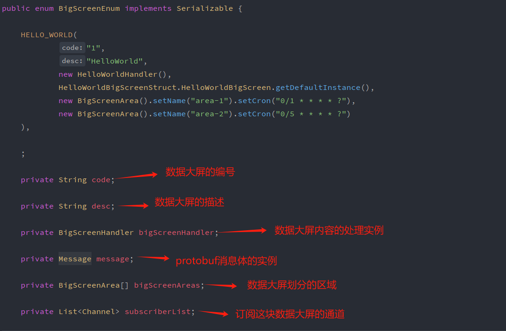
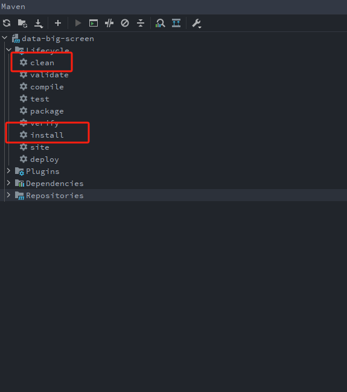
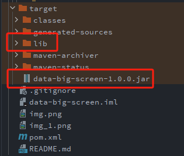

## 目录

- [项目简介](#项目简介)
- [相关技术及版本](#相关技术及版本)
- [快速开始](#快速开始)
- [项目构建](#项目构建)

---

## 项目简介

**data-big-screen**是基于netty并且使用websocket和protobuf建立的数据大屏项目，项目中对数据大屏的基本模型进行抽象以达到可扩展性，使用者只需要进行简单的配置和编写业务数据统计相关代码即可。

---

## 相关技术及版本

- **查阅pom.xml文件**

---

## 快速开始

- **定义承载大屏数据的protobuf结构文件并生成其相关代码，示例可查看HelloWorldBigScreen.proto和HelloWorldBigScreenStruct.java**
- **定义生成大屏数据的handler，示例可查看HelloWorldHandler.java**
- **在BigScreenEnum中配置数据大屏的相关信息**
- 
- **通过BigScreenApplication.java的main方法启动应用程序，通过ws://localhost:8443/webSocket?code=1进行连接，由于服务器端对数据使用gzip进行压缩，所以客户端获得数据后需要先使用gzip解压缩，然后再用protobuf反序列化**

---

## 项目构建

- 
- 

---